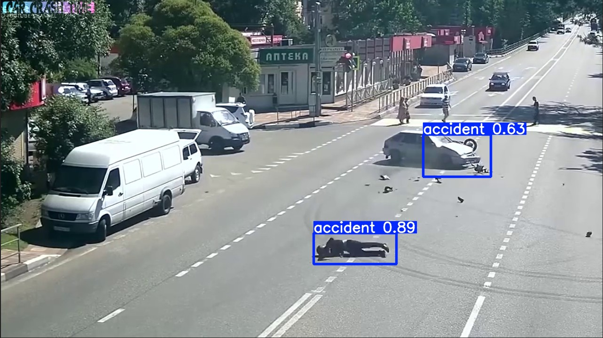

# Accident Detection using YOLO Trained on Custom Dataset.

This project implements road accident detection using YOLO.  
It supports training on a custom dataset, GPU acceleration (CUDA), and prediction on single images or folder containing multiple images.

Built with **PyTorch + Ultralytics YOLO**, and designed to be simple, modular and reproducible.

---

## Features

- Custom labeled dataset training using YOLO  
- GPU support (CUDA)  
- Predict on single image or entire directory  
- Clean project structure  
- CLI-based training & prediction  
- Results automatically saved  
- Jupyter Notebook support for experimentation  

---

## Tech Stack

## Tech Stack

- Python 
- PyTorch 
- Ultralytics YOLO 
- Uvcorn
- Labelimg

---

## How it works

1. Prepare Dataset – Collect road images and label accidents using LabelImg.

2. Organize Data – Split images and labels into train, val, and test folders.

3. Configure YOLO – Set paths and class names in data.yaml.

4. Train Model – Use training.py to train YOLO on your dataset.

    - Images are fed through YOLO’s CNN backbone.

    - Model learns to predict bounding boxes and class probabilities.

5. Evaluate – Training outputs metrics like Precision, Recall, mAP, and F1 score.

6. Predict – Use prediction.py to detect accidents in new images or folders.

    - Predictions include bounding boxes drawn around detected accidents.

7. Save Results – All predicted images are saved in the predictions/ folder for review.

8. Optional: Use Jupyter notebooks for visualization and experimentation.

---

## Project Structure

~~~python

YOLO-Accident-Detection-Custom-Data/
│
├── dataset/
│   ├── images/
│   │   ├── train/
│   │   ├── val/
│   │   └── test/
│   ├── labels/
│   │   ├── train/
│   │   ├── val/
│   │   └── test/
│   └── data.yaml
│
├── runs/
│   └── accident_train_v1/
│       └── weights/
│           ├── best.pt
│           └── last.pt
│
├── output/
│   └── results/
│
├── notebooks/
│   └── experiments.ipynb
│
├── src
│   ├── main.py
│   ├── prediction.py
│   └── training.py
│     
│
├── pyproject.toml
├── README.md

~~~

---

## 💻 Installation

Follow these steps to set up the **Accident Detection** project on your local machine.

1. Clone the Repository

~~~bash
    git clone https://github.com/your-username/accident-detection.git

    cd accident-detection
~~~

2. Create a Virtual Environment

It’s recommended to use a virtual environment to manage dependencies:

~~~bash
   
    python -m venv .venv

~~~

3. Install Dependencies Using pyproject.toml

---

## Example:

#### Input Image :

#### Output Image :

---

## Author and Contact

**Author:** Mohammad Hammad Ahmad 

**Email:** mdhammadahmadgithub@gmail.com 

**LinkedIn:**  https://www.linkedin.com/in/mohammad-hammad-ahmad-188628227  

Feel free to reach out via email or on LinkedIn.

---